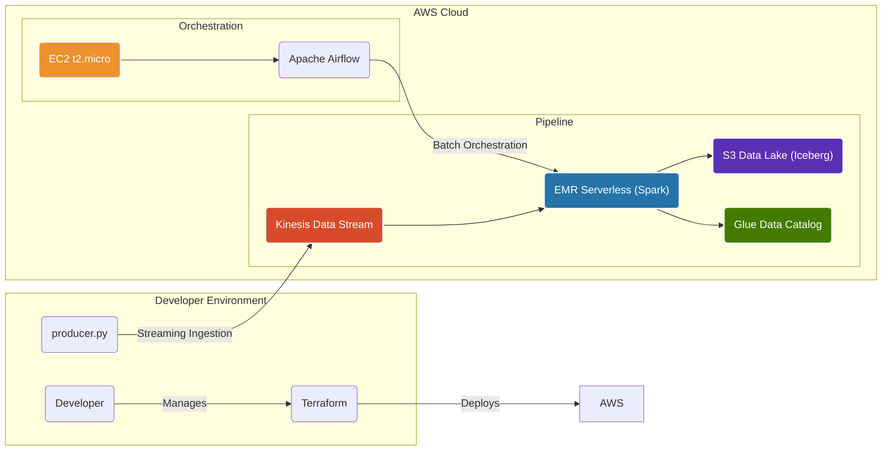

# Wikimedia Trends Engine v2 (Cloud-Native on AWS)
This repository contains the complete infrastructure and application code for a modern, cloud-native data platform built on Amazon Web Services. The project demonstrates an end-to-end solution for ingesting, processing, and storing data using parallel streaming and batch pipelines, with a focus on serverless technologies and Infrastructure as Code.

The primary goal is to showcase a scalable, cost-effective, and reproducible data architecture that can handle both real-time events and scheduled batch workloads.

## Architecture Overview
The platform consists of two distinct data pipelines that run in parallel, feeding into a unified data lakehouse built with Apache Iceberg. The entire infrastructure is managed by Terraform.



## Technology Stack
Cloud Provider: AWS

Infrastructure as Code (IaC): Terraform

Streaming Ingestion: Amazon Kinesis Data Streams

Data Processing: Amazon EMR Serverless (with Apache Spark)

Orchestration: Apache Airflow (running on an EC2 instance)

Storage: Amazon S3

Data Catalog: AWS Glue Data Catalog

Table Format: Apache Iceberg

Language: Python, PySpark, SQL


## Project Structure
```text
.
├── dags/                 # Airflow DAGs for orchestration
│   └── wikimedia_batch_dag.py
├── scripts/              # Python scripts for producer and Spark jobs
│   ├── producer.py
│   ├── streaming_job.py
│   └── batch_job.py
├── terraform/            # Terraform files for defining AWS infrastructure
│   ├── main.tf
│   ├── variables.tf
│   └── outputs.tf
└── README.md             # This file

```

## Deployment and Execution
### Prerequisites
An AWS Account.

AWS CLI installed and configured with credentials (aws configure).

Terraform installed locally.

### Step 1: Deploy the Infrastructure
All required AWS resources are provisioned using Terraform.
```
# Navigate to the terraform directory
cd terraform/

# Initialize Terraform
terraform init

# Review the planned changes
terraform plan

# Apply the configuration to create the resources
terraform apply
```
This command will provision the VPC, S3 bucket, Kinesis Stream, EMR Serverless Application, EC2 instance, and all necessary IAM roles. Note the outputs from Terraform, as you will need them (e.g., the Kinesis stream name and EC2 public IP).

### Step 2: Run the Kinesis Producer
To start feeding the streaming pipeline, run the producer script. You will need to configure it with the Kinesis stream name.

```
# Install dependencies
pip install boto3 sseclient-py

# Run the producer
python scripts/producer.py
```
### Step 3: Monitor the Pipelines
Streaming Job: Monitor the job runs and logs in the Amazon EMR Serverless UI in the AWS Console.

Batch Job: The batch job is orchestrated by Airflow. Once Airflow is set up on the EC2 instance, you can monitor the DAG runs and task statuses in the Airflow UI.

### Step 4: Destroy All Resources
This is the most important step for cost control. When you are finished working, tear down the entire infrastructure with a single command to avoid incurring further costs.

```
# From the terraform/ directory
terraform destroy
```